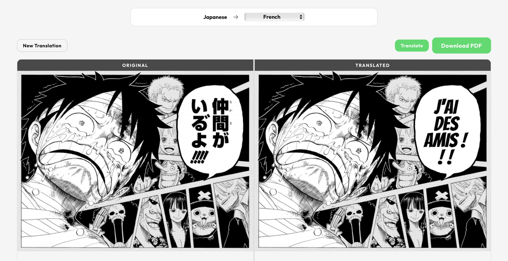
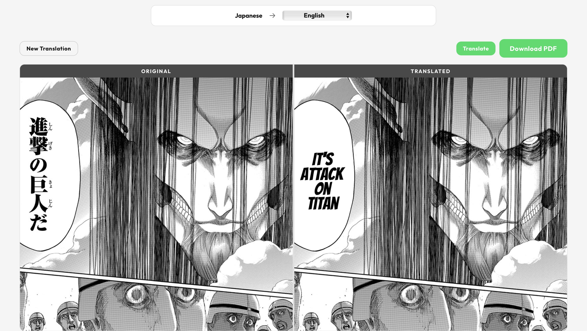
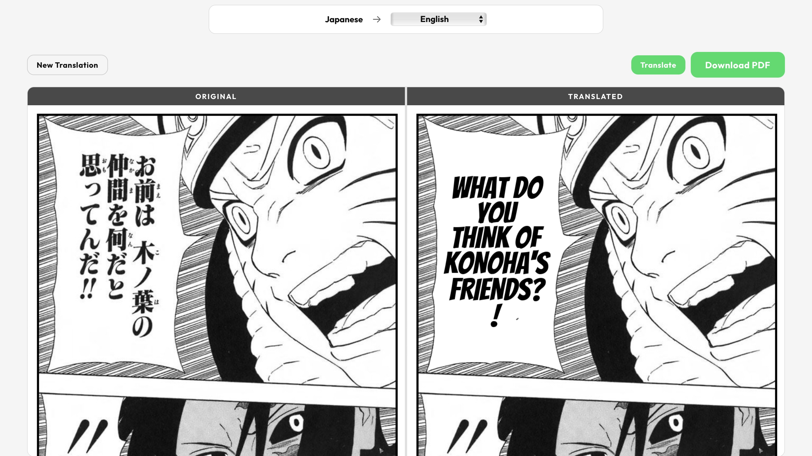

An end-to-end pipeline that takes raw manga pages — images or a full PDF — and returns them fully translated, with the original Japanese text cleanly erased and replaced with English (or 8 other languages). No manual cropping, no copy-pasting into Google Translate. Upload, hit Translate, done.

<p align="center">
  
</p>
<p align="center">
  
  
</p>

---

## What it does

Most fan-translation tools either require you to manually mark up every speech bubble, or they just overlay text without erasing the original. This project automates the whole thing:

1. **Detects speech bubbles** using a fine-tuned YOLOv8 model
2. **Segments text pixels** with a UNet++ model so the erase step is precise
3. **Runs OCR** on each bubble using manga-ocr, with preprocessing (CLAHE, upscaling) for small text
4. **Translates** — all bubbles from a page are sent to Google Translate 
5. **Erases the original text** via contour-based inpainting, handling both light and dark bubbles
6. **Renders the translation** back into the bubble with fonts and sizing that actually fit

The output is a side-by-side comparison view in the browser, plus a downloadable PDF of the translated chapter.

---

## Tech stack

**Backend**
- Python + FastAPI
- YOLOv8 (Ultralytics) for bubble detection
- UNet++ (segmentation-models-pytorch) for text masking
- manga-ocr for Japanese OCR
- Claude Haiku (Anthropic API) for contextual translation, Google Translate as fallback
- PyMuPDF for PDF ingestion
- OpenCV + Pillow for image processing

**Frontend**
- Vanilla JS, no framework
- Drag-and-drop upload, real-time progress polling, sync-scroll comparison view

---

## How to run it

**1. Clone and set up the environment**

```bash
git clone https://github.com/your-username/manga-translator
cd manga-translator
python -m venv .venv
source .venv/bin/activate
pip install -r backend/requirements.txt
```

**2. Start the server**

```bash
cd backend
uvicorn main:app --host 0.0.0.0 --port 8000
```

Open `http://localhost:8000` in your browser.

---

## Usage

- Drop one or more manga page images (PNG/JPG/WEBP) or a full PDF into the upload zone
- Pick a target language from the dropdown (English, French, Spanish, Chinese, Korean, Portuguese, German, Hindi, Arabic)
- Hit **Translate** and watch the progress bar
- When done, the comparison view shows original vs. translated side by side with synchronized scrolling
- Download the full translated chapter as a PDF

---

## Project layout

```
backend/
  main.py                  # FastAPI server — upload, translate, status endpoints
  pipeline/
    orchestrator.py        # Ties the whole pipeline together, page by page
    bubble_detector.py     # YOLOv8 inference + confidence filtering
    text_segmentation.py   # UNet++ text mask generation
    ocr.py                 # manga-ocr with preprocessing
    translator.py          # Claude Haiku + Google Translate fallback
    inpainter.py           # Text erasure
    text_renderer.py       # Fits translated text back into bubble
    lang_detect.py         # Auto-detects source language

frontend/
  index.html
  app.js                   # Upload flow, progress polling, comparison viewer
  style.css

fonts/                     # Noto Sans, Comic Neue, Bangers — multi-script support
```

---

## A few things worth noting

**Dark bubble handling** — narrator boxes and caption boxes typically have dark backgrounds with light text. The pipeline detects these by sampling the average brightness inside the bounding box and switches to a different inpainting and rendering path for them.

**Multi-script fonts** — the text renderer detects the script of the translated text (Latin, CJK, Hangul, Arabic, Devanagari) and picks the right font cascade, so a Japanese-to-Korean translation doesn't render with a Latin-only font.

---

## Supported languages

English, French, Spanish, Simplified Chinese, Traditional Chinese, Korean, Portuguese, German, Hindi, Arabic

---

## Requirements

- Python 3.9+
- PyTorch (CPU works, GPU recommended for speed)
- The YOLOv8 and UNet++ model weights download automatically from Hugging Face on first run
